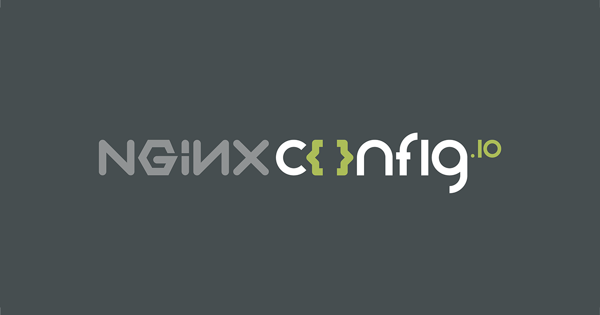

Online nginx configuration generator.

## Features
* HTTPS (with [Let's Encrypt](https://letsencrypt.org) or custom certificate, [Mozilla SSL Configuration Generator](https://mozilla.github.io/server-side-tls/ssl-config-generator/))
* HTTP2
* CDN
* www / non-www
* IPv4, IPv6
* PHP (TCP, 5.x FPM, 7.0 FPM, 7.1 FPM, 7.2 FPM)
* WordPress security essentials (*including [CVE-2018-6389](https://cve.mitre.org/cgi-bin/cvename.cgi?name=CVE-2018-6389)*)
* pass requests to index.php
	* *[Laravel](https://laravel.com/docs/master/deployment#nginx)*
	* *[Lumen](https://lumen.laravel.com/docs/5.1/installation#configuration)*
	* *[Symfony](https://symfony.com/doc/current/setup/web_server_configuration.html#nginx)*
	* *[Zend](https://www.nginx.com/resources/wiki/start/topics/recipes/zend/)*
	* *[CodeIgniter](https://www.nginx.com/resources/wiki/start/topics/recipes/codeigniter/)*
	* *[Yii](http://www.yiiframework.com/doc/guide/1.1/en/quickstart.apache-nginx-config#nginx)*
	* *[CakePHP](https://book.cakephp.org/3.0/en/installation.html#nginx)*
	* *[Slim](https://www.slimframework.com/docs/start/web-servers.html)*
	* …
* pass requests to index.html
	* *[Angular](https://angular.io/guide/deployment#production-servers)*
	* *[React](https://github.com/react-boilerplate/react-boilerplate/blob/v3.5.0/app/.nginx.conf#L81)*
	* *[Vue.js](https://stackoverflow.com/questions/47655869/how-to-use-vue-js-with-nginx)*
	* *[Ember.js](https://discuss.emberjs.com/t/how-to-serve-all-routes-on-a-production-server-exactly/6372)*
	* …
* unified (`nginx.conf`) / modularized file structure (ideal for multi-domain environment)
* security headers
	* `X-Frame-Options`
	* `X-XSS-Protection`
	* `X-Content-Type-Options`
	* `Referrer-Policy`
	* `Content-Security-Policy`
* `worker_processes`
* `user`
* `pid`
* `access_log`
* `error_log`
* `client_max_body_size`
* `gzip`
* `server_tokens`
* `log_not_found`
* rate limiting (`limit_req`)
* expiration by file types (`expires`)

## Built With
* [Bootstrap](http://getbootstrap.com) - Grid, form controls
* [AngularJS](https://angularjs.org) - Two-way data binding, template handling
* [highlight.js](https://highlightjs.org) - nginx syntax highlight
* [clipboard.js](https://clipboardjs.com) - Copy generated config to clipboard
* [ngclipboard](http://sachinchoolur.github.io/ngclipboard/) - AngularJS directive for clipboard.js
* [Angular Tooltips](https://720kb.github.io/angular-tooltips/) - helper tooltips
* [Masonry](https://masonry.desandro.com) - files grid layout
* [JSZip](https://stuk.github.io/jszip) - generating zip package
* [FileSaver](https://github.com/eligrey/FileSaver.js) - downloading zip file
